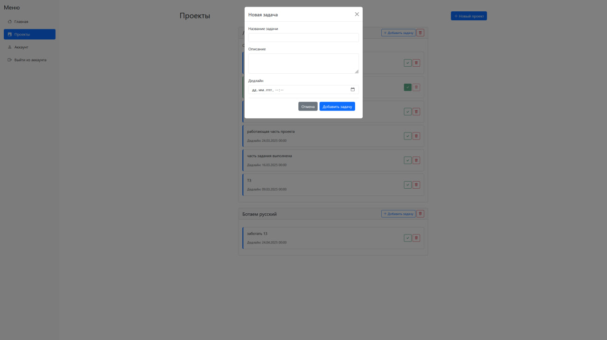

<h1>Chatter</h1>

## 🧱Установка

Вы можете клонировать [**репозиторий**](https://github.com/RomkaGP228/chatter) на вашу систему и установить
неоходимые зависимости или сделать все самостоятельно в терминале(для этого вам понадобится python версии 3.11-3.12 и
git):

```shell
git clone https://github.com/RomkaGP228/chatter.git
cd chatter

# Linux or Mac
python3 -m venv venv
source venv/bin/activate
pip3 install -r requirements.txt
python3 main.py

# Windows
python -m venv venv
venv\Scripts\activate
pip install -r requirements.txt
python main.py

# Далее перейдите по адресу: http://127.0.0.1:8080
# далее вам надо создать бота в телеграм через BotFather, получить токен бота вставить токен в config.py
# Сделать это можно через nano или блокнот
cd data/config
nano config
```


## О проекте

1. О проекте.
    - Название: Chatter
    - Назначение: Трекер Задач и дедлайнов
    - Тимлид и Разработчик: [**Роман Кулаков**](https://github.com/RomkaGP228)
    - Учитель: [**Алексей Анатольев**](https://github.com/anatolyev)
    - Ссылка на запись работы проекта: https://disk.yandex.ru/i/XReJlTZtGpp_kA
2. Количество строк кода:
    - Без учета HTML: 504 (main: 363, user: 21, project: 16, __all_models: 2, config: 1, db_session: 33, projects: 34, telegram_text: 14, users: 30)
    - С учетом HTML: 991 (account: 57, base: 46, index: 131, projects: 152, login: 36, register: 66)
3. [**Техническое задание**](materials/tecnical_spetification.md)

4. Управление для пользователя:
   - 
   - 
   - 
   - 
   - 
   - 

5. Небольшой список литературы и ресурсов:
   - habr:
      1. https://habr.com/ru/companies/otus/articles/692820/
      2. https://habr.com/ru/articles/848592/
      3. https://habr.com/ru/articles/194062/
      4. https://habr.com/ru/articles/808091/

   - digitologoly:
      1. https://digitology.tech/posts/otpravka-soobsheniya-v-telegram-s-ispolzovaniem-python/

   - stackoverflow:
      1. https://ru.stackoverflow.com/questions/931492/%D0%9E%D1%82%D0%BF%D1%80%D0%B0%D0%B2%D0%BA%D0%B0-%D1%81%D0%BE%D0%BE%D0%B1%D1%89%D0%B5%D0%BD%D0%B8%D1%8F-%D0%B2-%D0%BA%D0%B0%D0%BD%D0%B0%D0%BB-telegram-%D1%81%D1%80%D0%B5%D0%B4%D1%81%D1%82%D0%B2%D0%B0%D0%BC%D0%B8-python

   - w3schools:
      1. https://www.w3schools.com/TAGS/att_input_type_date.asp
      2. https://www.w3schools.com/tags/ref_httpmethods.asp
      3. https://www.w3schools.com/tags/tag_input.asp