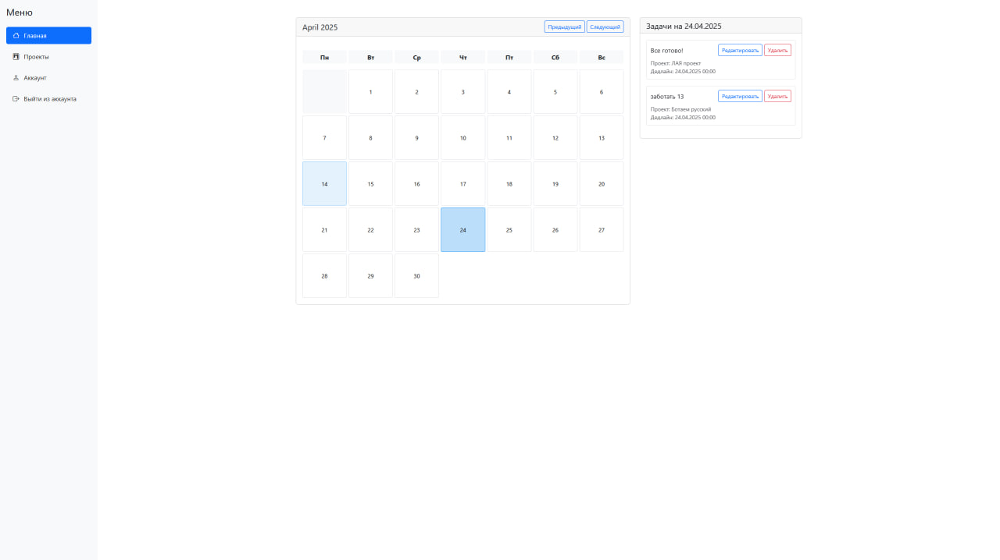
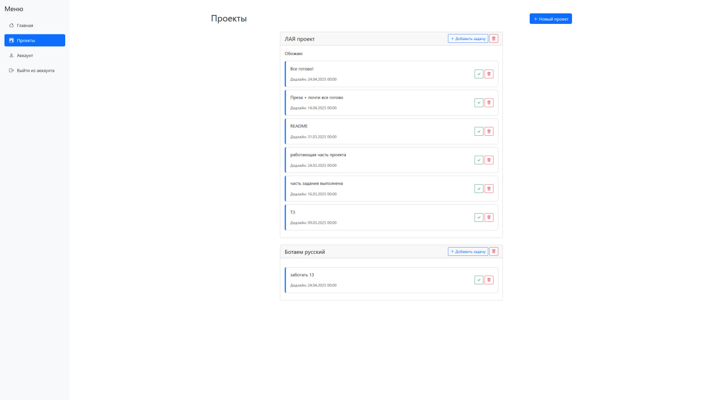
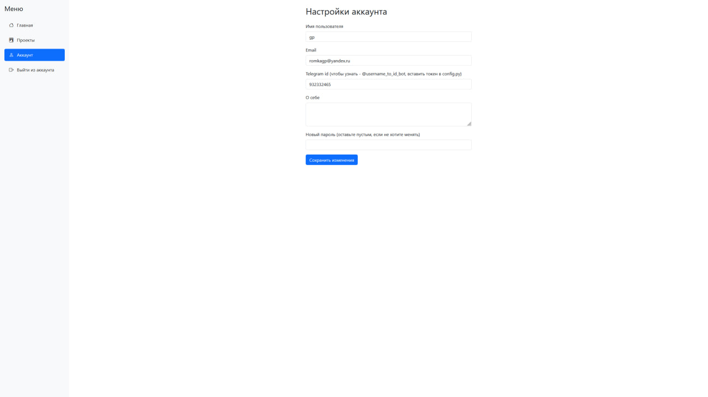
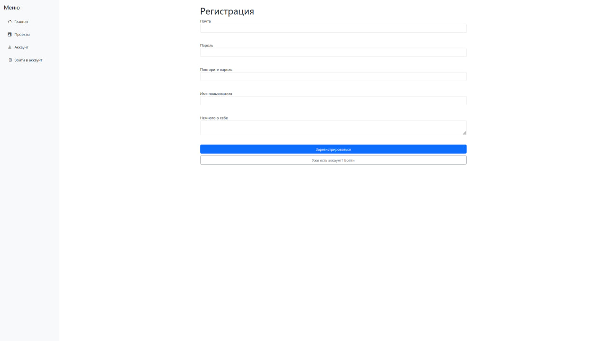
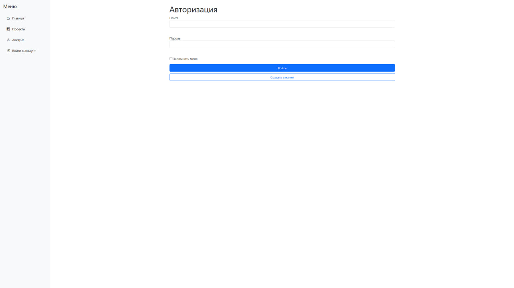

<h1>Chatter</h1>

## 🧱Установка

Вы можете клонировать [**репозиторий**](https://github.com/RomkaGP228/chatter.git) на вашу систему и установить
неоходимые зависимости или сделать все самостоятельно в терминале(для этого вам понадобится python версии 3.11-3.12 и
git):

```shell
git clone https://github.com/RomkaGP228/chatter.git
cd chatter

# Linux or Mac
python3 -m venv venv
source venv/bin/activate
pip3 install -r requirements.txt
python3 main.py

# Windows
python -m venv venv
venv\Scripts\activate
pip install -r requirements.txt
python main.py

# Далее перейдите по адресу: http://127.0.0.1:8080
# далее вам надо создать бота в телеграм через BotFather, получить токен бота вставить токен в config.py
# Сделать это можно через nano или блокнот
cd data/config
nano config
```


## О проекте

1. О проекте.
    - Название: Chatter
    - Назначение: Трекер Задач и дедлайнов
    - Тимлид и Разработчик: [**Роман Кулаков**](https://github.com/RomkaGP228)
    - Учитель: [**Алексей Анатольев**](https://github.com/anatolyev)
    - Ссылка на запись работы проекта: https://disk.yandex.ru/i/XReJlTZtGpp_kA
2. Количество строк кода:
    - Без учета HTML и CSS: 488
    - С учетом HTML и CSS: 977
3. [**Техническое задание**](materials/tecnical_spetification.md)

4. Управление для пользователя:
   - 
   - 
   - 
   - 
   - 